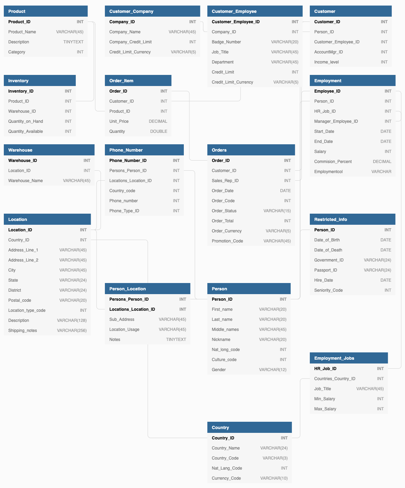

# Example of Modeling Relational Data in DynamoDB

This is based on the [AWS example](https://docs.aws.amazon.com/amazondynamodb/latest/developerguide/bp-relational-modeling.html). In this tutorial, I will explain the data structure we start with, and how to map that from their example to [arc](https://arc.codes) using best practices and get the most efficiency & scalability out of DynamoDB.

> *TLDR;* just look at [the code](https://github.com/konsumer/arc-example), and it will probably all make sense. If you want to understand how to really dig and get the most out of DynamoDB relational-data & [arc](https://arc.codes), read on.

## Relational Modeling

Traditional relational database management system (RDBMS) platforms store data in a normalized relational structure. This structure reduces hierarchical data structures to a set of common elements that are stored across multiple tables. The following schema is an example of a generic order-entry application with supporting HR schema backing the operational and business support systems of a theoretical manufacturer.



> It was helpful to me to actually build this data-structure to see how it fits together, as there were some details missing from the [AWS example](https://docs.aws.amazon.com/amazondynamodb/latest/developerguide/bp-relational-modeling.html). Have a look in [database/](./database) for various SQL model formats, so you can create your own database. You can also look at it as DBML, [here](https://dbdiagram.io/d/5e3337c29e76504e0ef0db37).

RDBMS platforms use an ad hoc query language (generally a flavor of SQL) to generate or materialize views of the normalized data to support application-layer access patterns.

For example, to generate a list of purchase order items sorted by the quantity in stock at all warehouses that can ship each item, you could issue the following query against the preceding schema.

```sql
SELECT * FROM Orders
  INNER JOIN Order_Items ON Orders.Order_ID = Order_Items.Order_ID
  INNER JOIN Products ON Products.Product_ID = Order_Items.Product_ID
  INNER JOIN Inventories ON Products.Product_ID = Inventories.Product_ID
  ORDER BY Quantity_on_Hand DESC
```

One-time queries of this kind provide a flexible API for accessing data, but they require a significant amount of processing. You must often query the data from multiple locations, and the results must be assembled for presentation. The preceding query initiates complex queries across a number of tables and then sorts and integrates the resulting data.

Another factor that can slow down RDBMS systems is the need to support an ACID-compliant transaction framework. The hierarchical data structures used by most online transaction processing (OLTP) applications must be broken down and distributed across multiple logical tables when they are stored in an RDBMS. Therefore, an ACID-compliant transaction framework is necessary to avoid race conditions that could occur if an application tries to read an object that is in the process of being written. Such a transaction framework necessarily adds significant overhead to the write process.

These two factors are the primary barriers to scale for traditional RDBMS platforms. It remains to be seen whether the NewSQL community can be successful in delivering a distributed RDBMS solution. But it is unlikely that even that would resolve the two limitations described earlier. No matter how the solution is delivered, the processing costs of normalization and ACID transactions must remain significant.

For this reason, when your business requires low-latency response to high-traffic queries, taking advantage of a NoSQL system generally makes technical and economic sense. Amazon DynamoDB helps solve the problems that limit relational system scalability by avoiding them.

A relational database system does not scale well for the following reasons:

* It normalizes data and stores it on multiple tables that require multiple queries to write to disk.
* It generally incurs the performance costs of an ACID-compliant transaction system.
* It uses expensive joins to reassemble required views of query results.

DynamoDB scales well for these reasons:

* Schema flexibility lets DynamoDB store complex hierarchical data within a single item.
* Composite key design lets it store related items close together on the same table.
* Queries against the data store become much simpler, often in the following form:

Queries against the data store become much simpler, often in the following form:

```sql
SELECT * FROM Table_X WHERE Attribute_Y = "somevalue"
```
DynamoDB does far less work to return the requested data compared to the RDBMS in the earlier example.

## First Steps

> NoSQL design, and specifically DynamoDB, requires a different mindset than RDBMS design. For an RDBMS, you can create a normalized data model without thinking about access patterns. You can then extend it later when new questions and query requirements arise. By contrast, in DynamoDB, you shouldn't start designing your schema until you know the questions that it needs to answer. Understanding the business problems and the application use cases up front is absolutely essential.

To start designing a DynamoDB table that will scale efficiently, you must take several steps first to identify the access patterns that are required by the operations and business support systems (OSS/BSS) that it needs to support:

* For new applications, review user stories about activities and objectives. Document the various use cases you identify, and analyze the access patterns that they require.
* For existing applications, analyze query logs to find out how people are currently using the system and what the key access patterns are.

After completing this process, you should end up with a list that might look something like the following:

| Most Common/Important Access Patterns in Our Organization                  |
| -------------------------------------------------------------------------- |
| Look up Employee Details by Employee ID                                    |
| Query Employee Details by Employee Name                                    |
| Get an employee's current job details only                                 |
| Get Orders for a customer for a date range                                 |
| Show all Orders in OPEN status for a date range across all customers       |
| All Employees Hired recently                                               |
| Find all employees in specific Warehouse                                   |
| Get all Order items for a Product including warehouse location inventories |
| Get customers by Account Rep                                               |
| Get orders by Account Rep and date                                         |
| Get all employees with specific Job Title                                  |
| Get inventory by Product and Warehouse                                     |
| Get total product inventory                                                |
| Get Account Reps ranked by Order Total and Sales Period                    |

In a real application, your list might be much longer. But this collection represents the range of query pattern complexity that you might find in a production environment.

A common approach to DynamoDB schema design is to identify application layer entities and use denormalization and composite key aggregation to reduce query complexity.

In DynamoDB, this means using composite sort keys, overloaded global secondary indexes, partitioned tables/indexes, and other design patterns. You can use these elements to structure the data so that an application can retrieve whatever it needs for a given access pattern using a single query on a table or index. The primary pattern that you can use to model the normalized schema shown in [Relational Modeling](https://docs.aws.amazon.com/amazondynamodb/latest/developerguide/bp-relational-modeling.html) is the adjacency list pattern. Other patterns used in this design can include global secondary index write sharding, global secondary index overloading, composite keys, and materialized aggregations.

> In general, you should maintain as few tables as possible in a DynamoDB application. Most well-designed applications require only one table. Exceptions include cases where high-volume time series data are involved, or datasets that have very different access patterns. A single table with inverted indexes can usually enable simple queries to create and retrieve the complex hierarchical data structures required by your application.

## Example

This example describes how to model relational data in Amazon DynamoDB. A DynamoDB table design corresponds to the relational order entry schema that is shown in [Relational Modeling](https://docs.aws.amazon.com/amazondynamodb/latest/developerguide/bp-relational-modeling.html). It follows the [Adjacency List Design Pattern](https://docs.aws.amazon.com/amazondynamodb/latest/developerguide/bp-adjacency-graphs.html#bp-adjacency-lists), which is a common way to represent relational data structures in DynamoDB.

The design pattern requires you to define a set of entity types that usually correlate to the various tables in the relational schema. Entity items are then added to the table using a compound (partition and sort) primary key. The partition key of these entity items is the attribute that uniquely identifies the item and is referred to generically on all items as PK. The sort key attribute contains an attribute value that you can use for an inverted index or global secondary index. It is generically referred to as SK.

You define the following entities, which support the relational order entry schema:

1. `Employee` - *PK*: `EmployeeID`, *SK*: `Employee Name`
1. `Region` - *PK*: `RegionID`, *SK*: `Region Name`
1. `Country` - *PK*: `CountryId`, *SK*: `Country Name`
1. `Location` - *PK*: `LocationID`, *SK*: `Country Name`
1. `Job` - *PK*: `JobID`, *SK*: `Job Title`
1. `Department` - *PK*: `DepartmentID`, *SK*: `DepartmentID`
1. `Customer` - *PK*: `CustomerID`, *SK*: `AccountRepID`
1. `Order` - *PK*: `OrderID`, *SK*: `CustomerID`
1. `Product` - *PK*: `ProductID`, *SK*: `Product Name`
1. `Warehouse` - *PK*: `WarehouseID`, *SK*: `Region Name`

After adding these entity items to the table, you can define the relationships between them by adding edge items to the entity item partitions. The following table demonstrates this step:

<!-- TODO: turn this into a markdown table? -->


> We put them all in one table, and partition using *PK* in order to improve partition-efficiency (help with scaling) as data that goes together will stay together, on-disk.

In this example, the Employee, Order, and Product Entity partitions on the table have additional edge items that contain pointers to other entity items on the table. Next, define a few global secondary indexes (GSIs) to support all the access patterns defined previously. The entity items don't all use the same type of value for the primary key or the sort key attribute. All that is required is to have the primary key and sort key attributes present to be inserted on the table.

The fact that some of these entities use proper names and others use other entity IDs as sort key values allows the same global secondary index to support multiple types of queries. This technique is called GSI overloading. It effectively eliminates the default limit of 20 global secondary indexes for tables that contain multiple item types. This is shown in the following diagram as GSI 1:

<!-- TODO: turn this into a markdown table? -->


GSI 2 is designed to support a fairly common application access pattern, which is to get all the items on the table that have a certain state. For a large table with an uneven distribution of items across available states, this access pattern can result in a hot key, unless the items are distributed across more than one logical partition that can be queried in parallel. This design pattern is called `write sharding`.

To accomplish this for GSI 2, the application adds the GSI 2 primary key attribute to every Order item. It populates that with a random number in a range of 0–N, where N can generically be calculated using the following formula, unless there is a specific reason to do otherwise:

```
ItemsPerRCU = 4KB / AvgItemSize
PartitionMaxReadRate = 3K * ItemsPerRCU
N = MaxRequiredIO / PartitionMaxReadRate
```

For example, assume that you expect the following:

* Up to 2 million orders will be in the system, growing to 3 million in 5 years.
* Up to 20 percent of these orders will be in an OPEN state at any given time.
* The average order record is around 100 bytes, with three OrderItem records in the order partition that are around 50 bytes each, giving you an average order entity size of 250 bytes.

For that table, the N factor calculation would look like the following:

```
ItemsPerRCU = 4KB / 250B = 16
PartitionMaxReadRate = 3K * 16 = 48K
N = (0.2 * 3M) / 48K = 13
```

In this case, you need to distribute all the orders across at least 13 logical partitions on GSI 2 to ensure that a read of all Order items with an OPEN status doesn't cause a hot partition on the physical storage layer. It is a good practice to pad this number to allow for anomalies in the dataset. So a model using `N = 15` is probably fine. As mentioned earlier, you do this by adding the random 0–N value to the GSI 2 PK attribute of each Order and OrderItem record that is inserted on the table.

This breakdown assumes that the access pattern that requires gathering all `OPEN` invoices occurs relatively infrequently so that you can use burst capacity to fulfill the request. You can query the following global secondary index using a State and Date Range Sort Key condition to produce a subset or all Orders in a given state as needed.

<!-- TODO: turn this into a markdown table? -->


In this example, the items are randomly distributed across the 15 logical partitions. This structure works because the access pattern requires a large number of items to be retrieved. Therefore, it's unlikely that any of the 15 threads will return empty result sets that could potentially represent wasted capacity. A query always uses 1 read capacity unit (RCU) or 1 write capacity unit (WCU), even if nothing is returned or no data is written.

If the access pattern requires a high velocity query on this global secondary index that returns a sparse result set, it's probably better to use a hash algorithm to distribute the items rather than a random pattern. In this case, you might select an attribute that is known when the query is executed at run time and hash that attribute into a 0–14 key space when the items are inserted. Then they can be efficiently read from the global secondary index.

> You can have a look at [data.json](src/tools/data.json) if you want to see how all this fits together (JSON might be easier to read than all these tables.)

> They didn't mention it in the [AWS example](https://docs.aws.amazon.com/amazondynamodb/latest/developerguide/bp-relational-modeling.html), but we will sometimes need to look things up by GSI2's SK, so I made a reverse-lookup index for that in GSI3.

## implementation

Finally, you can revisit the access patterns that were defined earlier. Following is the list of access patterns and the query conditions that you will use with the new DynamoDB version of the application to accommodate them:

| Access Patterns                                                            | API Function                                                         | Query Conditions                                                               |
| --------------------------------------------------------------------------:|:--------------------------------------------------------------------:|:-------------------------------------------------------------------------------|
| Look up Employee Details by Employee ID                                    | `employeeDetailsById(*employeeID)`                                   | `PK="HR-{employeeID}"`                                                         |
| Query Employee ID by Employee Name                                         | `employeeIdByName(*employeeName)`                                    | `GSI1_PK={employeeName}`                                                       |
| Get an employee's current job details only                                 | `employeeCurrentJob(*employeeID)`                                    | `PK="HR-{employeeID}", SK.beginsWith("J")`                                     |
| Get Orders for a customer for a date range                                 | `ordersByCustomer(*customerID, status="OPEN", start=EPOCH, end=NOW)` | `PK={employeeID}, SK.between("{status}-{start}", "{status}#{end}")`            |
| Show all Orders in OPEN status for a date range across all customers       | `ordersOpen(start=EPOCH, end=NOW, status="OPEN")`                    | `GSI2_PK=parallell([0...N]), SK.between("{status}#{start}", "{status}#{end}")` |
| All Employees Hired recently                                               | `employeesRecent(start=MONTHAGO)`                                    | `GSI1_PK="HR-CONFIDENTIAL", GSI1_SK > {start}`                                 |
| Find all employees in specific Warehouse                                   | `employeesByWarehouse(*warehouseID)`                                 | `GSI1_PK={warehouseID}`                                                        |
| Get all Order items for a Product including warehouse location inventories | `ordersByProduct(*productID)`                                        | `GSI1_PK={productID}`                                                          |
| Get customers by Account Rep                                               | `customerByRep(*employeeID)`                                         | `GSI1_PK={employeeID}`                                                         |
| Get orders by Account Rep and date                                         | `ordersByRep(*employeeID, status="OPEN", start=EPOCH)`               | `GSI1_PK={employeeID}, GSI1_SK="{status}#{start}"`                             |
| Get all employees with specific Job Title                                  | `employeesByTitle(*title)`                                           | `GSI1_PK="JH-{title}"`                                                         |
| Get inventory by Product and Warehouse                                     | `inventoryByWarehouse(*productID, *warehouseID)`                     | `PK="OE-{productID}", SK={warehouseID}`                                        |
| Get total product inventory                                                | `inventory(*productID)`                                              | `PK="OE-{productID}", SK={productID}`                                          |
| Get Account Reps ranked by Order Total and Sales Period                    | `accountRepsRankedByTotalAndQuarter(*quarter)`                       | `GSI1_PK={quarter}, scanindexForward=False`                                    |

`SK`s hold data that should be indexed, but isn't the primary partion (`employeeName`, for example, which is a param but not the `employeeID`.) `GSI1_PK` is a reverse-lookup for `SK`, `GSI2_PK` is a partition to spread data evenly (`RND(0...N)`), `GSI3_PK` is a reverse-lookup of `GSI1_SK`.

```
PK      = Primary Identifier
SK      = ParamIndex1
GS1_PK -> SK
GS1_SK  = ParamIndex2
GS2_PK  = GSIBucket
GS3_PK -> GS1_SK
```

## mapping this to arc

> I really like to just put this all in code, directly. I make a central file that describes the whole table as functions. Have a look at [this file](src/api.js) to see how I have mapped these to an arc dynamo client. It's pretty much 1-to-1.

Here we start where [AWS example](https://docs.aws.amazon.com/amazondynamodb/latest/developerguide/bp-relational-modeling.html) leaves off, and turn this into a sweet arc-app. Now that we have a model setup, and know what our access patterns will be, let's turn this all into arc definitions & code:

**[.arc](.arc)**:
```
@app
YOURAPP

@tables
hroe
  PK *String        # Primary Identifier
  SK **String       # ParamIndex1

@indexes
hroe
  SK *String        # GSI1_PK
  GSI1_SK **String  # ParamIndex2
hroe
  GSI2_PK *Number   # GSIBucket
hroe
  GSI1_SK *String   # GSI3_PK

```

You may notice I am using `hroe` 3 times, in `@indexes` (GSI) as they will be on that table. I'm not using any operators (like pluses or dashes) or [reserved words](https://docs.aws.amazon.com/amazondynamodb/latest/developerguide/ReservedWords.html) in any of the actual field-names, because it will confuse dynamo when we make queries.

### make a service & frontend

At this point, you will often setup a REST or GraphQL service or other data-server layer (for your frontend.)  In a real app, you'd want to tune your data-access patterns to how you're going to serve up the data. For example, with REST, it's all about LCRUD for base-types, with params for any search/filtering. For a GraphQL server, you'd focus more on LCRUD for base-types, then type-joins with params to link records, and if needed add some `Query` RPCs. With gRPC, you'll be focused on just the RPCs needed to actually act on the data. In all 3 cases, the way you craft your indexes should be optimized to keep all the similar data togeter, require as few roundtrips as possible, and efficiently pull just the useful stuff for what you are trying to do.

In your app you will probably need some basic LCRUD (List, Create, Read, Update, Delete) methods for `Employees`, `Regions`, `Countries`, `Locations`, `Jobs`, `Departments`, `Customers`, `Orders`, `Products`, and `Warehouses`, so we can fully manage our data. I left these out, as I made a simple mock-data generator (`npm run setup`) and HTML frontend.

I whipped up a simple set of forms and post-handlers to quickly expose [the API](src/api.js) to the web, so we can explore it. I wanted to keep this article focused on the [AWS example](https://docs.aws.amazon.com/amazondynamodb/latest/developerguide/bp-relational-modeling.html) and keep things as simple as possible. 

**[.arc](.arc)**:
```
@http
get /
post /
```

I just put all the forms in `get /` and the handlers in `post /`. In your own app, after adding stuff like this to [.arc](.arc), you can run `arc init` to create stubs for these in `src/http/`.

**TODO**: Make tutorials like this for GraphQL/REST server, with same models & data, but different access patterns and key-structure, tuned to target.


### test it out

* Run `npm i` to install your tools & dependencies
* Run `npm start` to run a local development-server
* Run `npm setup` in another terminal to setup your demo-data
* Open [the demo forms](http://localhost:3333) to explore your data

You can also use regular [aws cli tools](https://aws.amazon.com/cli/) to navigate the sandbox-database:
```
aws --endpoint-url=http://localhost:5000 dynamodb list-tables
```

## finishing up

Now you've got a whole arc app. Here are some tools:

```
# run a local development server
arc sandbox

# deploy your app on AWS
arc deploy

# live interact with your schema
# try typing data.<TAB>
arc repl

# get a sam.json that describes all your resources
arc package
```

I like to put these commands in [package.json](package.json) `script` definitions, so other devs (who may be less familiar with arc) can quickly do stuff with the project, and it also helps remind me, if I get rusty with arc-commands:

```
# install tools & dependencies
npm i

# generate stubs for whatever is defined in .arc, in src/
npm run init

# setup local mock-data
npm run setup

# start a local dev-server
npm start

# deploy on AWS
npm run deploy

# run unit-tests
npm test
```

Another bonus of this, is that the `arc` command is already in the user's path, because it's setup in `devDependencies`, so no other installation is needed (aside from `npm i`.)
